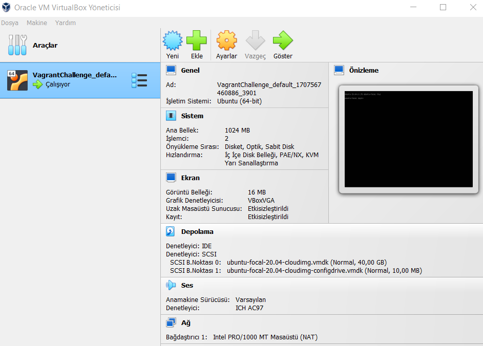

# VagrantChallenge
Vagrant Challenge Python Flask app Ansible Gunicorn

## Vagrant Nedir?

Vagrant, Yazılım geliştirme projeleri için hızlı ve tekrarlanabilir bir şekilde sanal makineler oluşturulmasını sağlayan araçtır.


## Proje Adımları

1. GitHub'da repo oluşturuldu ve lokale clone edildi.
2. Lokalde ilgili klasörün içine gidildi:

    ```bash
    cd Desktop/VagrantChallenge/
    ```

3. Vagrant dosyası (`Vagrantfile`) oluşturuldu:

    ```bash
    vagrant init ubuntu/focal64
    ```
    vagrant init komutu, bulunduğunuz konumda örnek bir vagrantFile oluşturur. Bu örnekte, Ubuntu 20.04 LTS sanal makinesi kullanıldı.
    Bir diğer yöntem olarak Vagrantfile'ı kendiniz oluşturabilirsiniz, bunun için aşağıdaki komutları girebilirsiniz.

    ```ruby
    Vagrant.configure("2") do |config|
      config.vm.box = "ubuntu/focal64"
    end
    ```

## Vagrantfile Dosyası

```ruby
Vagrant.configure("2") do |config|

  config.vm.box = "ubuntu/focal64"
  
  config.vm.network "forwarded_port", guest: 8000, host: 8000

  config.vm.provision "ansible" do |ansible|
    ansible.playbook = "provision.yml"
  end
  
end
```
Sanal makinede çalıştırılan portun host makinede erişilebilmesi için ilgili port `guest` parametresine tanımlanır. Host makinede erişilmesi istenilen port ise `host` parametresine tanımlanır. Bu şekilde tanımlanan port, host makinede `localhost` üzerinden erişim sağlanır.

```ruby
config.vm.network "forwarded_port", guest: 8000, host: 8000
```

Sanal makineye otomatik yapılandırma sağlamak için Ansible kullanıldı. ansible.playbook ifadesi ile hangi Ansible playbook'unun kullanılacağını belirtir. Bu örnekte, provision.yml isimli playbook belirtildi.

```ruby
config.vm.provision "ansible" do |ansible|
  ansible.playbook = "provision.yml"
end
```

## provision.yml dosyası

```yaml
- hosts: all
  become: yes
  tasks:
    - name: Update package cache
      apt:
        update_cache: yes

    - name: Install Python 3 and pip
      apt:
        name: "{{ item }}"
        state: present
      with_items:
        - python3
        - python3-pip

    - name: Install Flask and Gunicorn
      pip:
        name: "{{ item }}"
        state: present
      with_items:
        - flask
        - gunicorn

    - name: Copy Flask application
      copy:
        src: ./app/
        dest: /home/vagrant/
        
    - name: Start Gunicorn service for Flask application
      shell: gunicorn --bind 0.0.0.0:8000 app:app
      args:
        chdir: /home/vagrant/
```

Uygulama python üzerinden geliştirildiğinden ilk olarak çalıştırılacak olan makinede `apt` paket yöneticisi ile `python3` ve `pip` uygulamaları yüklendi. Projenin kullandığı kütüphane ve bağımlılıkları (`flask`, `gunicorn`) için `pip` ile yüklenmesi sağlandı. `copy` komutu kullanılarak proje dosyalarının hedef makineye gönderildi. `shell` modülü kullanılarak Gunicorn komutu çalıştırılır. Gunicorn, 0.0.0.0:8000 adresinde dinleme yapar ve uygulama klasörü (/home/vagrant/) altında çalıştırılır. 

Gunicorn, Python uygulamalarının web sunucusu olarak çalıştırılmasını sağlar ve bu durumda bir Flask uygulamasını çalıştırmak için kullanılmaktadır.

1. Sanal makineyi başlatmak için bu komut çalıştırılır

    ```bash
    vagrant up
    ```
    
    
   
    

2. Sanal makineyi kapatmak için:

    ```bash
    vagrant halt
    ```

3. Sanal makinayı tamamen silmek için:

    ```bash
    vagrant destroy
    ```

